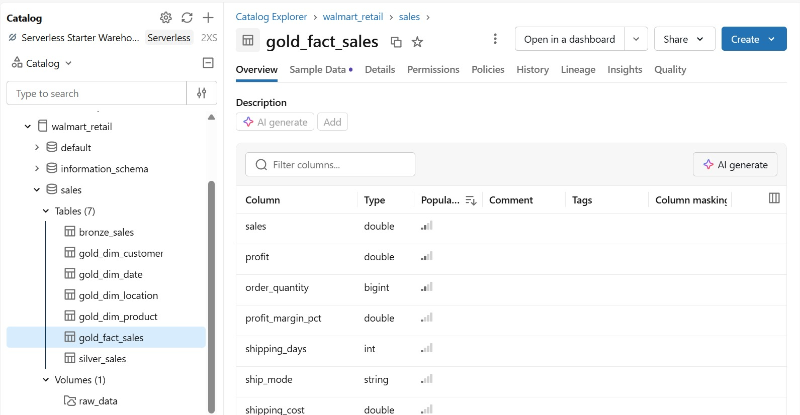
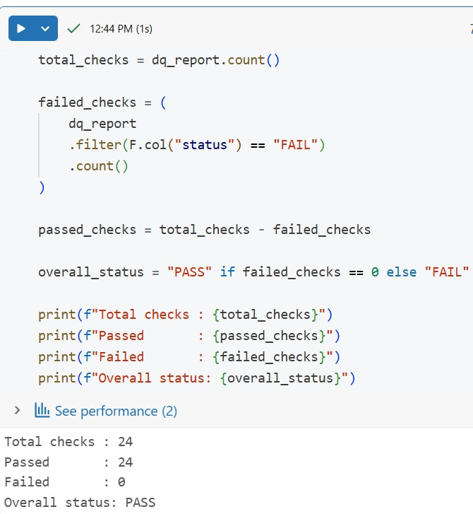
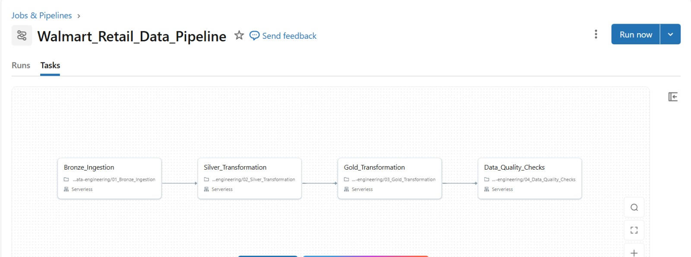
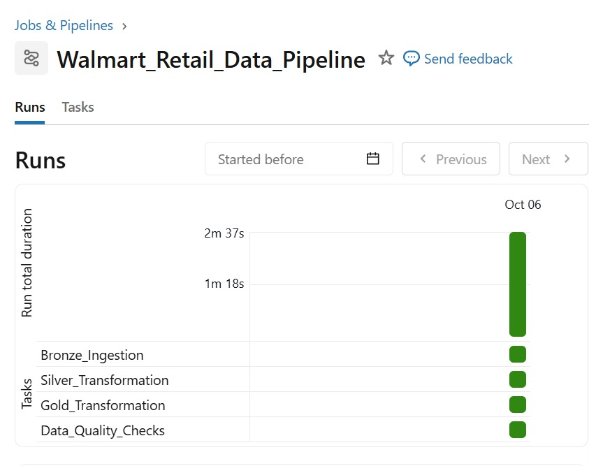
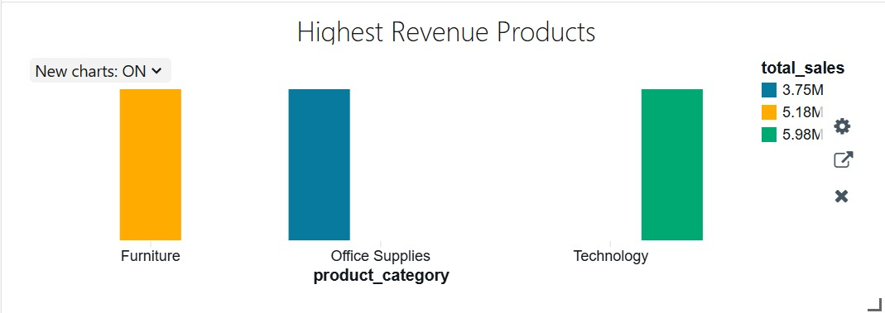
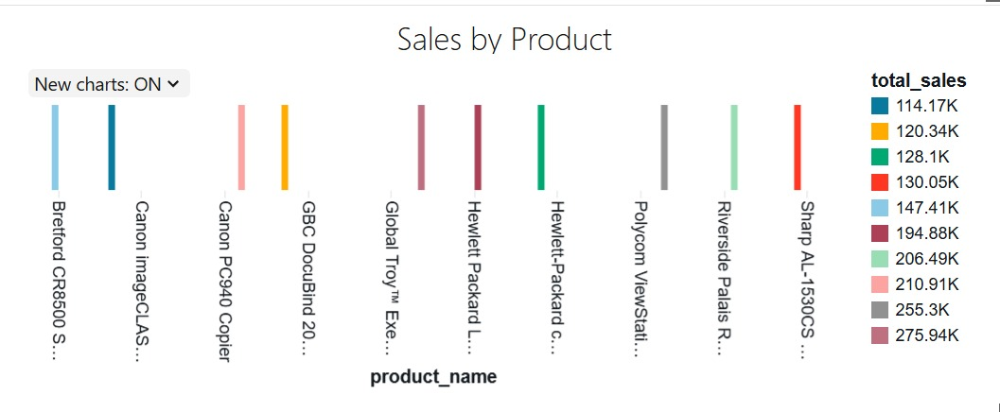
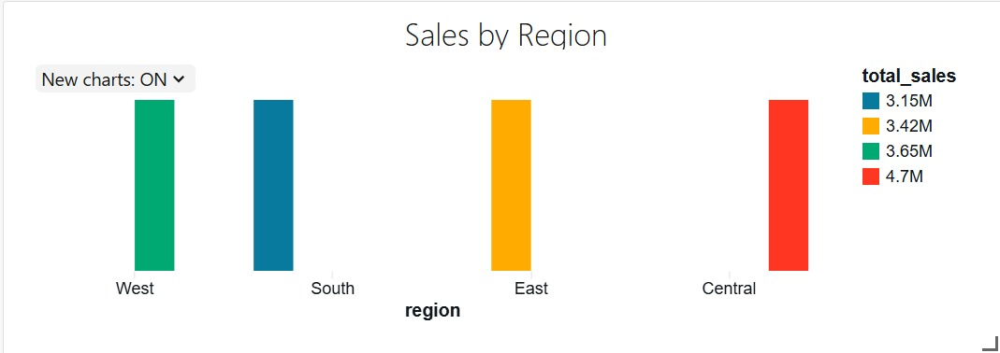

# Walmart Retail Sales Data Engineering Pipeline

An end-to-end Data Engineering project built with Databricks, PySpark, Delta Lake, Unity Catalog, and SQL.

The project processes 8,399 Walmart retail transactions through a Bronze → Silver → Gold architecture, builds a dimensional data model, validates data quality, orchestrates the pipeline using Databricks Workflows, and performs SQL-based business analysis.

---

## Architecture

                    Walmart Retail Excel Data
                              |
                              v
                    +--------------------+
                    |   Bronze Layer     |
                    |    Raw Delta       |
                    +--------------------+
                              |
                              v
                    +--------------------+
                    |   Silver Layer     |
                    | Cleaned & Standard |
                    +--------------------+
                              |
                              v
                    +--------------------+
                    |    Gold Layer      |
                    | Fact + Dimensions  |
                    +--------------------+
                         /          \
                        v            v
                 Data Quality     SQL Analytics
                        |            |
                        +-----+------+
                              |
                              v
                     Databricks Dashboard

---

## Tech Stack

Databricks · PySpark · Apache Spark · Delta Lake · Unity Catalog · Python · SQL · Pandas · OpenPyXL · Databricks Workflows

---

## Data Pipeline

### Bronze Layer

Raw Walmart Excel data is ingested into a Delta table:

walmart_retail.sales.bronze_sales

- 8,399 rows
- 25 source columns
- Source data preserved with minimal transformation

### Silver Layer

The Silver layer cleans and standardizes the Bronze data.

Key transformations include:

- Date type conversion
- Numeric type standardization
- String trimming
- ZIP code standardization
- Business-rule validation
- Duplicate detection

Table:

walmart_retail.sales.silver_sales

### Gold Layer

The Gold layer uses a star-schema design consisting of one fact table and four dimension tables.

| Table | Records |
|---|---:|
| gold_fact_sales | 8,399 |
| gold_dim_customer | 989 |
| gold_dim_product | 1,264 |
| gold_dim_date | 1,418 |
| gold_dim_location | 1,636 |

The fact table also contains derived metrics such as:

- gross_sales
- discount_amount
- profit_margin_pct
- shipping_days

### Gold Data Model

---

## Data Quality

A dedicated data-quality framework validates the pipeline before downstream analytics.

The framework checks:

- Row counts
- Null values
- Duplicate records
- Business rules
- Invalid discounts
- Invalid quantities
- Shipping-date consistency
- Gold surrogate keys

### Validation Result

24 / 24 checks passed

Total checks : 24
Passed       : 24
Failed       : 0
Status       : PASS

The data-quality notebook also acts as a workflow quality gate. If validation fails, the pipeline raises an exception and prevents downstream processing.

---

## Databricks Workflow

The pipeline is orchestrated using Databricks Workflows.

Bronze Ingestion
       ↓
Silver Transformation
       ↓
Gold Transformation
       ↓
Data Quality Checks

The workflow was successfully executed with the complete dependency chain.

---

## SQL Analytics

The Gold layer is queried using Databricks SQL to answer business questions including:

- Overall sales and profit performance
- Product category performance
- Regional performance
- Monthly sales trends
- Top revenue-generating products
- Customer segment performance
- State-level analysis
- Shipping performance
- Loss-making products

### Top Revenue-Generating Products

### Sales by Product Category

### Sales by Region

---

## Key Results

| Metric | Result |
|---|---:|
| Transactions | 8,399 |
| Source Columns | 25 |
| Total Sales | $14.92M |
| Total Profit | $1.52M |
| Data Quality Checks | 24 / 24 Passed |

---

## Project Structure

walmart-sales-data-engineering-pipeline/
│
├── notebooks/
│   ├── 01_Bronze_Ingestion.ipynb
│   ├── 02_Silver_Transformation.ipynb
│   ├── 03_Gold_Transformation.ipynb
│   └── 04_Data_Quality_Checks.ipynb
│
├── sql/
│   └── 06_Gold_Analytics.sql
│
├── images/
│   ├── data_quality.png
│   ├── gold_model.png
│   ├── highest_revenue_products.png
│   ├── job_pipeline.jpeg
│   ├── job_run.png
│   ├── sales_by_product.png
│   └── sales_by_region.png
│
├── .gitignore
└── README.md

---

## What This Project Demonstrates

- Medallion architecture
- PySpark ETL development
- Delta Lake
- Unity Catalog
- Star-schema dimensional modeling
- Fact and dimension tables
- Surrogate keys
- Data-quality validation
- Workflow orchestration
- Analytical SQL
- Business-focused data analysis
- Databricks visualization

---

## Future Improvements

- Incremental data ingestion
- Parameterized pipeline execution
- Automated scheduling
- Additional Delta Lake optimization
- Dashboard filtering
- Pipeline monitoring and alerting
- Cloud object-storage integration

---

## Author

Keerthanaa Jayaprakash

Data Engineering | Databricks | PySpark | SQL | Delta Lake
